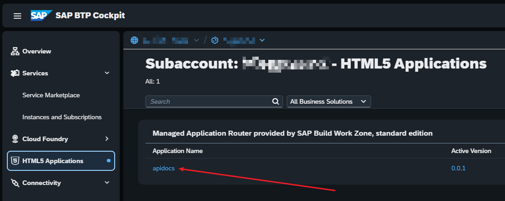
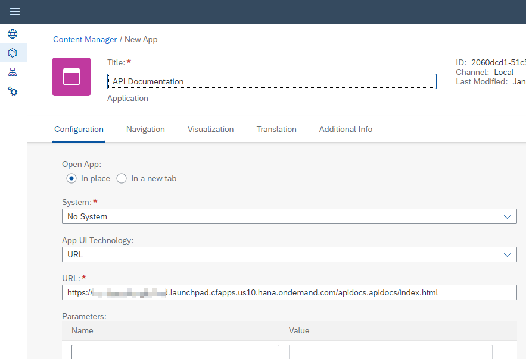

# API Documentation with Swagger UI hosted on SAP BTP

Shows different approaches on how to host the [Swagger UI](https://github.com/swagger-api/swagger-ui) on SAP BTP inside an HTML5 repository.

All three approaches assume that a subscription of [SAP Build Workzone, Standard Edition](https://help.sap.com/docs/build-work-zone-standard-edition?locale=en-US) exists in the targeted subaccount. So the `mta.yaml` configuration does not contain an approuter module.

## [Flavor 1](./plain-html5-all-local/): HTML5 with index.html and local Swagger UI distribution

The complete Swagger UI distribution is pushed to the HTML5 container and css/js files are locally referenced in the `index.html` file.  
The Open API specification is also contained in the deployed application.

## [Flavor 2](./plain-html5-with-cdn/): HTML5 with index.html and Swagger UI distribution from `unpkg`

Here the `index.html` file is loading the Swagger UI css/js files from `unpkg`.

## [Flavor 3](./sapui5-component-wrapper/): Local Swagger UI distribution hosted inside SAPUI5 Component

The Swagger UI is again locally hosted but this time it is wrapped in a simple SAPUI5 Component to make the inclusion in a SAP Build Workzone site via component id possible.

## Remarks to Flavor 1 and 2

Here we have to specify the full path to deployed `index.html` file in a custom tile configuration, to enable the inclusion in a SAP Build Workzone site. The link to the application can be taken from the HTML5 application overview on the Subaccount:

Sample URL: `https://<subaccount-subdomain>.launchpad.cfapps.<region>.hana.ondemand.com/apidocs.apidocs-0.0.1/index.html`

*Note*: The version number in the URL is optional and can be removed (i.e. `-0.0.1`).

### Sample Tile Configuration

